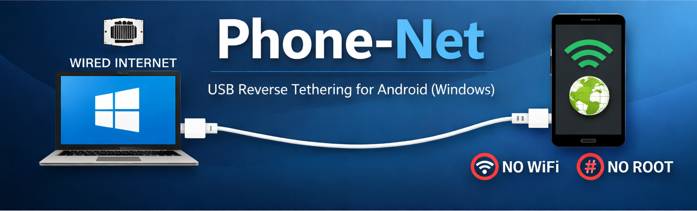

<p align="center">
  
</p>

# 📱 Phone-Net — USB Reverse Tethering for Android (Windows)

Use your **Windows PC wired Ethernet** connection on your **Android phone** over USB.  
No Wi-Fi hotspot, no mobile data, no battery drain.

Built for fast, reliable development & testing.

---

## 🚀 Features

- Reverse tethering: **PC → Phone over USB**
- No root required
- Fully portable folder
- One-click start & stop
- Auto-downloads dependencies
- Clean shutdown (VPN + adb)
- Logging for debugging
- Works with Samsung Galaxy S25 and all modern Android devices

---

## 📦 Folder Layout

```
phone-net/
├─ start-phone-net.bat
├─ stop-phone-net.bat
├─ README.md
├─ LICENSES.md
├─ .gitignore
├─ gnirehtet-rust-win64/ (auto-downloaded)
├─ platform-tools/ (auto-downloaded)
├─ *.log (runtime logs)
```

Only the `.bat` files and documentation are tracked in Git.

---

## ⚙️ Requirements

- Windows 10 / 11
- USB cable
- Android phone
- Developer Mode enabled
- USB debugging enabled

---

## 🔧 One-Time Phone Setup

On your phone:

```
Settings → About phone → Software info → Tap "Build number" 7 times
Settings → Developer options → Enable "USB debugging"
```

Approve the USB debugging prompt when connecting to the PC.

---

## ▶ Start Internet on Phone

1. Connect phone via USB  
2. Double-click:

```
start-phone-net.bat
```

On first run:
- Dependencies will be downloaded automatically
- Gnirehtet VPN permission prompt will appear on the phone → **Allow**

Your phone is now using your PC's Ethernet connection.

---

## ⏹ Stop & Clean Everything

Double-click:

```
stop-phone-net.bat
```

This will:
- Stop reverse tethering
- Remove VPN
- Kill adb server
- Kill leftover adb.exe
- Restore normal phone networking

---

## 🧾 Logs

Each run generates logs:

```
start-phone-net.log
stop-phone-net.log
```

Logs are auto-cleared on every new run.

---

## 🔐 Security Notes

- Gnirehtet uses Android's built-in VPN API
- No traffic inspection
- No credential interception
- No permanent system changes
- adb access is limited to the connected phone

---

## 🧩 Third-Party Software

This project uses open-source tools under the Apache License 2.0.

See full details in:
➡ [LICENSES.md](LICENSES.md)

---

## 🏁 Summary

This setup gives you:
- Wired-speed internet on your phone
- Zero Wi-Fi dependency
- Perfect for development, QA, and testing environments

---

## 💡 Credits

Reverse tethering powered by **Gnirehtet**  
Android tooling by **Google Platform Tools**
